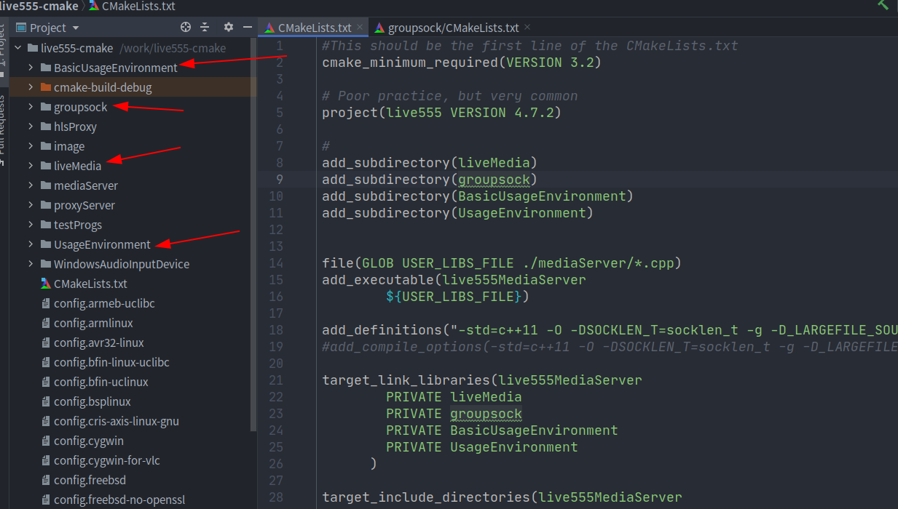

# `cmake-live555`

### 工程总览

从零开始手写`cmake`工程管理`live555`开源代码，新的工程已经开源到`github`上，代码仓库地址：

[github仓库地址](https://github.com/zzu-andrew/live555-cmake)

欢迎fork和转发



剪头指向的为4个库，每个库里面建议一个`CMakeLists.txt`文件用于生成对应的库，剩下的几个文件夹除了`WindowsAudioImputDevice`没有使用外(因为我是在`linux`上实现的)，其他的都在主目录下的`CMakeLists.txt`文件中添加可执行文件。

`UsageEnvironment`目录中生命了一些虚类

`BasicUsageEnvironment`主要是对目录`UsageEnvironment`中定义的虚类的实现

`groupsock`主要实现了对`socket`封装，在`liveMedia`目录中涉及网络的部分会使用

`liveMedia`目录是整个`live555`开发库的核心部分


`TODO`:增加生成器表达式，后期 可以根据`cmake`选项生成是否含有符号信息的可执行程序

`TODO`:挨个分析`live555`源码


### 使用方式

1. `Clion`导入已有工程

2. 手动编译

```bash
#进入打工程目录
cd live555-cmake
# 创建编译目录
mkdir build
# 进入到build目录
cd build
#构建 Makefile
cmake ..
# make 生成可执行文件
make
```


### 各个库的创建


`UsageEnvironment`实现的`CMakeLists.txt`如下，实现将`UsageEnvironment`里的源文件编译成对应的库文件，这里生测还给你的库文件是`UsageEnvironment`  `cmake`会自动给库添加上`lib`前缀，所以最终生成`libUsageEnvironment.a`

```cmake
#This should be the first line of the CMakeLists.txt
cmake_minimum_required(VERSION 3.2)

# Poor practice, but very common
project(live555 VERSION 4.7.2)

file(GLOB USER_LIBS_FILE ./*.cpp)

add_library(UsageEnvironment 
        STATIC
        ${USER_LIBS_FILE})

add_definitions("-Wall -g")
add_definitions("-std=c++11 -O -DSOCKLEN_T=socklen_t -g -D_LARGEFILE_SOURCE=1 -D_FILE_OFFSET_BITS=64 -Wall -DBSD=1")
#add_compile_options(-std=c++11 -O -DSOCKLEN_T=socklen_t -g -D_LARGEFILE_SOURCE=1 -D_FILE_OFFSET_BITS=64 -Wall -DBSD=1)

target_include_directories(UsageEnvironment 
        PUBLIC .
        PUBLIC include
        PUBLIC ../groupsock/include)

```

同样实现了

`BasicUsageEnvironment`库的建立

```cmake
#This should be the first line of the CMakeLists.txt
cmake_minimum_required(VERSION 3.2)

# Poor practice, but very common
project(live555 VERSION 4.7.2)


file(GLOB USER_LIBS_FILE ./*.cpp)

add_library(BasicUsageEnvironment 
        STATIC
        ${USER_LIBS_FILE})

add_definitions("-Wall -g")
add_definitions("-std=c++11 -O -DSOCKLEN_T=socklen_t -g -D_LARGEFILE_SOURCE=1 -D_FILE_OFFSET_BITS=64 -Wall -DBSD=1")
#add_compile_options(-std=c++11 -O -DSOCKLEN_T=socklen_t -g -D_LARGEFILE_SOURCE=1 -D_FILE_OFFSET_BITS=64 -Wall -DBSD=1)

target_include_directories(BasicUsageEnvironment 
        PUBLIC .
        PUBLIC include
        PUBLIC ../UsageEnvironment/include
        PUBLIC ../groupsock/include)
```

`groupsock`库的简历

```cmake
#This should be the first line of the CMakeLists.txt
cmake_minimum_required(VERSION 3.2)

# Poor practice, but very common
project(live555 VERSION 4.7.2)


file(GLOB USER_LIBS_FILE ./*.cpp)
file(GLOB USER_LIBS_C_FILE ./*.c)

add_library(groupsock 
        STATIC
        ${USER_LIBS_FILE}
        ${USER_LIBS_C_FILE})

add_definitions("-std=c++11 -O -DSOCKLEN_T=socklen_t -g -D_LARGEFILE_SOURCE=1 -D_FILE_OFFSET_BITS=64 -Wall -DBSD=1")
#add_compile_options(-std=c++11 -O -DSOCKLEN_T=socklen_t -g -D_LARGEFILE_SOURCE=1 -D_FILE_OFFSET_BITS=64 -Wall -DBSD=1)

target_include_directories(groupsock 
        PUBLIC .
        PUBLIC include
        PUBLIC ./../
        ../UsageEnvironment/include)
```

`liveMedia`库的建立

```cmake
#This should be the first line of the CMakeLists.txt
cmake_minimum_required(VERSION 3.2)

# Poor practice, but very common
project(live555 VERSION 4.7.2)


file(GLOB USER_LIBS_FILE ./*.cpp)
file(GLOB USER_LIBS_C_FILE ./*.c)

add_library(liveMedia 
        STATIC
        ${USER_LIBS_FILE}
        ${USER_LIBS_C_FILE})

add_definitions("-Wall -g")
add_definitions("-std=c++11 -O -DSOCKLEN_T=socklen_t -g -D_LARGEFILE_SOURCE=1 -D_FILE_OFFSET_BITS=64 -Wall -DBSD=1")
#add_compile_options(-std=c++11 -O -DSOCKLEN_T=socklen_t -g -D_LARGEFILE_SOURCE=1 -D_FILE_OFFSET_BITS=64 -Wall -DBSD=1)

target_link_libraries(liveMedia
        PUBLIC ssl
        PUBLIC crypto
      )
target_include_directories(liveMedia 
        PUBLIC .
        PUBLIC include
        PUBLIC ../UsageEnvironment/include
        PUBLIC ../groupsock/include)

```

以及在主目录中创建个个可执行程序，以及`live555MediaServer`

```cmake
#This should be the first line of the CMakeLists.txt
cmake_minimum_required(VERSION 3.2)

# Poor practice, but very common
project(live555 VERSION 4.7.2)

#
add_subdirectory(liveMedia)
add_subdirectory(groupsock)
add_subdirectory(BasicUsageEnvironment)
add_subdirectory(UsageEnvironment)


file(GLOB USER_LIBS_FILE ./mediaServer/*.cpp)
add_executable(live555MediaServer
        ${USER_LIBS_FILE})   

add_definitions("-std=c++11 -O -DSOCKLEN_T=socklen_t -g -D_LARGEFILE_SOURCE=1 -D_FILE_OFFSET_BITS=64 -Wall -DBSD=1")
#add_compile_options(-std=c++11 -O -DSOCKLEN_T=socklen_t -g -D_LARGEFILE_SOURCE=1 -D_FILE_OFFSET_BITS=64 -Wall -DBSD=1)

target_link_libraries(live555MediaServer
        PRIVATE liveMedia
        PRIVATE groupsock
        PRIVATE BasicUsageEnvironment
        PRIVATE UsageEnvironment
      )

target_include_directories(live555MediaServer 
        PUBLIC .
        PUBLIC include
        PUBLIC UsageEnvironment/include
        PUBLIC groupsock/include
        PUBLIC liveMedia/include
        PUBLIC BasicUsageEnvironment/include)

# proxy live555
add_executable(live555ProxyServer proxyServer/live555ProxyServer.cpp)  
target_link_libraries(live555ProxyServer
        PRIVATE liveMedia
        PRIVATE groupsock
        PRIVATE BasicUsageEnvironment
        PRIVATE UsageEnvironment
      )
target_include_directories(live555ProxyServer 
        PUBLIC .
        PUBLIC include
        PUBLIC UsageEnvironment/include
        PUBLIC groupsock/include
        PUBLIC liveMedia/include
        PUBLIC BasicUsageEnvironment/include)
# hls live555
add_executable(live555HLSProxy hlsProxy/live555HLSProxy.cpp)  
target_link_libraries(live555HLSProxy
        PRIVATE liveMedia
        PRIVATE groupsock
        PRIVATE BasicUsageEnvironment
        PRIVATE UsageEnvironment
      )
target_include_directories(live555HLSProxy 
        PUBLIC .
        PUBLIC include
        PUBLIC UsageEnvironment/include
        PUBLIC groupsock/include
        PUBLIC liveMedia/include
        PUBLIC BasicUsageEnvironment/include)

# test programe
add_executable(testMP3Streamer testProgs/testMP3Streamer.cpp)  
target_link_libraries(testMP3Streamer
        PUBLIC ssl
        PUBLIC crypto
        PRIVATE liveMedia
        PRIVATE groupsock
        PRIVATE BasicUsageEnvironment
        PRIVATE UsageEnvironment
      )
target_include_directories(testMP3Streamer 
        PUBLIC .
        PUBLIC include
        PUBLIC UsageEnvironment/include
        PUBLIC groupsock/include
        PUBLIC liveMedia/include
        PUBLIC BasicUsageEnvironment/include)

#
add_executable(testMPEG1or2VideoStreamer testProgs/testMPEG1or2VideoStreamer.cpp)  
target_link_libraries(testMPEG1or2VideoStreamer
        PUBLIC ssl
        PUBLIC crypto
        PRIVATE liveMedia
        PRIVATE groupsock
        PRIVATE BasicUsageEnvironment
        PRIVATE UsageEnvironment
        )
target_include_directories(testMPEG1or2VideoStreamer 
        PUBLIC .
        PUBLIC include
        PUBLIC UsageEnvironment/include
        PUBLIC groupsock/include
        PUBLIC liveMedia/include
        PUBLIC BasicUsageEnvironment/include)

add_executable(testMPEG1or2AudioVideoStreamer testProgs/testMPEG1or2AudioVideoStreamer.cpp)  
target_link_libraries(testMPEG1or2AudioVideoStreamer
        PUBLIC ssl
        PUBLIC crypto
        PRIVATE liveMedia
        PRIVATE groupsock
        PRIVATE BasicUsageEnvironment
        PRIVATE UsageEnvironment
        )
target_include_directories(testMPEG1or2AudioVideoStreamer 
        PUBLIC .
        PUBLIC include
        PUBLIC UsageEnvironment/include
        PUBLIC groupsock/include
        PUBLIC liveMedia/include
        PUBLIC BasicUsageEnvironment/include)


add_executable(testMPEG2TransportStreamer testProgs/testMPEG2TransportStreamer.cpp)  
target_link_libraries(testMPEG2TransportStreamer
        PUBLIC ssl
        PUBLIC crypto
        PRIVATE liveMedia
        PRIVATE groupsock
        PRIVATE BasicUsageEnvironment
        PRIVATE UsageEnvironment
        )
target_include_directories(testMPEG2TransportStreamer 
        PUBLIC .
        PUBLIC include
        PUBLIC UsageEnvironment/include
        PUBLIC groupsock/include
        PUBLIC liveMedia/include
        PUBLIC BasicUsageEnvironment/include)
##########################################################
add_executable(testH264VideoStreamer testProgs/testH264VideoStreamer.cpp)  
target_link_libraries(testH264VideoStreamer
        PUBLIC ssl
        PUBLIC crypto
        PRIVATE liveMedia
        PRIVATE groupsock
        PRIVATE BasicUsageEnvironment
        PRIVATE UsageEnvironment
        )
target_include_directories(testH264VideoStreamer 
        PUBLIC .
        PUBLIC include
        PUBLIC UsageEnvironment/include
        PUBLIC groupsock/include
        PUBLIC liveMedia/include
        PUBLIC BasicUsageEnvironment/include)

add_executable(testH265VideoStreamer testProgs/testH265VideoStreamer.cpp)  
target_link_libraries(testH265VideoStreamer
        PUBLIC ssl
        PUBLIC crypto
        PRIVATE liveMedia
        PRIVATE groupsock
        PRIVATE BasicUsageEnvironment
        PRIVATE UsageEnvironment
        )
target_include_directories(testH265VideoStreamer 
        PUBLIC .
        PUBLIC include
        PUBLIC UsageEnvironment/include
        PUBLIC groupsock/include
        PUBLIC liveMedia/include
        PUBLIC BasicUsageEnvironment/include)

add_executable(testDVVideoStreamer testProgs/testDVVideoStreamer.cpp)  
target_link_libraries(testDVVideoStreamer
        PUBLIC ssl
        PUBLIC crypto
        PRIVATE liveMedia
        PRIVATE groupsock
        PRIVATE BasicUsageEnvironment
        PRIVATE UsageEnvironment
        )
target_include_directories(testDVVideoStreamer 
        PUBLIC .
        PUBLIC include
        PUBLIC UsageEnvironment/include
        PUBLIC groupsock/include
        PUBLIC liveMedia/include
        PUBLIC BasicUsageEnvironment/include)


add_executable(testWAVAudioStreamer testProgs/testWAVAudioStreamer.cpp)  
target_link_libraries(testWAVAudioStreamer
        PUBLIC ssl
        PUBLIC crypto
        PRIVATE liveMedia
        PRIVATE groupsock
        PRIVATE BasicUsageEnvironment
        PRIVATE UsageEnvironment
        )

target_include_directories(testWAVAudioStreamer 
        PUBLIC .
        PUBLIC include
        PUBLIC UsageEnvironment/include
        PUBLIC groupsock/include
        PUBLIC liveMedia/include
        PUBLIC BasicUsageEnvironment/include)

add_executable(testAMRAudioStreamer testProgs/testAMRAudioStreamer.cpp)  
target_link_libraries(testAMRAudioStreamer
        PUBLIC ssl
        PUBLIC crypto
        PRIVATE liveMedia
        PRIVATE groupsock
        PRIVATE BasicUsageEnvironment
        PRIVATE UsageEnvironment
        )
target_include_directories(testAMRAudioStreamer 
        PUBLIC .
        PUBLIC include
        PUBLIC UsageEnvironment/include
        PUBLIC groupsock/include
        PUBLIC liveMedia/include
        PUBLIC BasicUsageEnvironment/include)

add_executable(testMKVStreamer testProgs/testMKVStreamer.cpp)  
target_link_libraries(testMKVStreamer
        PUBLIC ssl
        PUBLIC crypto
        PRIVATE liveMedia
        PRIVATE groupsock
        PRIVATE BasicUsageEnvironment
        PRIVATE UsageEnvironment
        )
target_include_directories(testMKVStreamer 
        PUBLIC .
        PUBLIC include
        PUBLIC UsageEnvironment/include
        PUBLIC groupsock/include
        PUBLIC liveMedia/include
        PUBLIC BasicUsageEnvironment/include)

add_executable(testOggStreamer testProgs/testOggStreamer.cpp)  
target_link_libraries(testOggStreamer
        PUBLIC ssl
        PUBLIC crypto
        PRIVATE liveMedia
        PRIVATE groupsock
        PRIVATE BasicUsageEnvironment
        PRIVATE UsageEnvironment
        )
target_include_directories(testOggStreamer 
        PUBLIC .
        PUBLIC include
        PUBLIC UsageEnvironment/include
        PUBLIC groupsock/include
        PUBLIC liveMedia/include
        PUBLIC BasicUsageEnvironment/include)


add_executable(vobStreamer testProgs/vobStreamer.cpp)  
target_link_libraries(vobStreamer
        PUBLIC ssl
        PUBLIC crypto
        PRIVATE liveMedia
        PRIVATE groupsock
        PRIVATE BasicUsageEnvironment
        PRIVATE UsageEnvironment
        )
target_include_directories(vobStreamer 
        PUBLIC .
        PUBLIC include
        PUBLIC UsageEnvironment/include
        PUBLIC groupsock/include
        PUBLIC liveMedia/include
        PUBLIC BasicUsageEnvironment/include)

add_executable(testMP3Receiver testProgs/testMP3Receiver.cpp)  
target_link_libraries(testMP3Receiver
        PUBLIC ssl
        PUBLIC crypto
        PRIVATE liveMedia
        PRIVATE groupsock
        PRIVATE BasicUsageEnvironment
        PRIVATE UsageEnvironment
        )
target_include_directories(testMP3Receiver 
        PUBLIC .
        PUBLIC include
        PUBLIC UsageEnvironment/include
        PUBLIC groupsock/include
        PUBLIC liveMedia/include
        PUBLIC BasicUsageEnvironment/include)


add_executable(testMPEG2TransportReceiver testProgs/testMPEG2TransportReceiver.cpp)  
target_link_libraries(testMPEG2TransportReceiver
        PUBLIC ssl
        PUBLIC crypto
        PRIVATE liveMedia
        PRIVATE groupsock
        PRIVATE BasicUsageEnvironment
        PRIVATE UsageEnvironment
        )
target_include_directories(testMPEG2TransportReceiver 
        PUBLIC .
        PUBLIC include
        PUBLIC UsageEnvironment/include
        PUBLIC groupsock/include
        PUBLIC liveMedia/include
        PUBLIC BasicUsageEnvironment/include)

add_executable(sapWatch testProgs/sapWatch.cpp)  
target_link_libraries(sapWatch
        PUBLIC ssl
        PUBLIC crypto
        PRIVATE liveMedia
        PRIVATE groupsock
        PRIVATE BasicUsageEnvironment
        PRIVATE UsageEnvironment
        )
target_include_directories(sapWatch 
        PUBLIC .
        PUBLIC include
        PUBLIC UsageEnvironment/include
        PUBLIC groupsock/include
        PUBLIC liveMedia/include
        PUBLIC BasicUsageEnvironment/include)

##################################
add_executable(testRelay testProgs/testRelay.cpp)  
target_link_libraries(testRelay
        PUBLIC ssl
        PUBLIC crypto
        PRIVATE liveMedia
        PRIVATE groupsock
        PRIVATE BasicUsageEnvironment
        PRIVATE UsageEnvironment
        )
target_include_directories(testRelay 
        PUBLIC .
        PUBLIC include
        PUBLIC UsageEnvironment/include
        PUBLIC groupsock/include
        PUBLIC liveMedia/include
        PUBLIC BasicUsageEnvironment/include)
add_executable(testReplicator testProgs/testReplicator.cpp)  
target_link_libraries(testReplicator
        PUBLIC ssl
        PUBLIC crypto
        PRIVATE liveMedia
        PRIVATE groupsock
        PRIVATE BasicUsageEnvironment
        PRIVATE UsageEnvironment
        )
target_include_directories(testReplicator 
        PUBLIC .
        PUBLIC include
        PUBLIC UsageEnvironment/include
        PUBLIC groupsock/include
        PUBLIC liveMedia/include
        PUBLIC BasicUsageEnvironment/include)

add_executable(testOnDemandRTSPServer testProgs/testOnDemandRTSPServer.cpp)  
target_link_libraries(testOnDemandRTSPServer
        PUBLIC ssl
        PUBLIC crypto
        PRIVATE liveMedia
        PRIVATE groupsock
        PRIVATE BasicUsageEnvironment
        PRIVATE UsageEnvironment
        )
target_include_directories(testOnDemandRTSPServer 
        PUBLIC .
        PUBLIC include
        PUBLIC UsageEnvironment/include
        PUBLIC groupsock/include
        PUBLIC liveMedia/include
        PUBLIC BasicUsageEnvironment/include)

add_executable(testRTSPClient testProgs/testRTSPClient.cpp)  
target_link_libraries(testRTSPClient
        PUBLIC ssl
        PUBLIC crypto
        PRIVATE liveMedia
        PRIVATE groupsock
        PRIVATE BasicUsageEnvironment
        PRIVATE UsageEnvironment
        )
target_include_directories(testRTSPClient 
        PUBLIC .
        PUBLIC include
        PUBLIC UsageEnvironment/include
        PUBLIC groupsock/include
        PUBLIC liveMedia/include
        PUBLIC BasicUsageEnvironment/include)

add_executable(openRTSP 
        testProgs/openRTSP.cpp
        testProgs/playCommon.cpp)  
target_link_libraries(openRTSP
        PUBLIC ssl
        PUBLIC crypto
        PRIVATE liveMedia
        PRIVATE groupsock
        PRIVATE BasicUsageEnvironment
        PRIVATE UsageEnvironment
        )
target_include_directories(openRTSP 
        PUBLIC .
        PUBLIC include
        PUBLIC UsageEnvironment/include
        PUBLIC groupsock/include
        PUBLIC liveMedia/include
        PUBLIC BasicUsageEnvironment/include)
        
add_executable(playSIP 
        testProgs/playSIP.cpp
        testProgs/playCommon.cpp)  
target_link_libraries(playSIP
        PUBLIC ssl
        PUBLIC crypto
        PRIVATE liveMedia
        PRIVATE groupsock
        PRIVATE BasicUsageEnvironment
        PRIVATE UsageEnvironment
        )
target_include_directories(playSIP 
        PUBLIC .
        PUBLIC include
        PUBLIC UsageEnvironment/include
        PUBLIC groupsock/include
        PUBLIC liveMedia/include
        PUBLIC BasicUsageEnvironment/include)

add_executable(testH264VideoToHLSSegments 
        testProgs/testH264VideoToHLSSegments.cpp)  
target_link_libraries(testH264VideoToHLSSegments
        PUBLIC ssl
        PUBLIC crypto
        PRIVATE liveMedia
        PRIVATE groupsock
        PRIVATE BasicUsageEnvironment
        PRIVATE UsageEnvironment
        )
target_include_directories(testH264VideoToHLSSegments 
        PUBLIC .
        PUBLIC include
        PUBLIC UsageEnvironment/include
        PUBLIC groupsock/include
        PUBLIC liveMedia/include
        PUBLIC BasicUsageEnvironment/include)

add_executable(testMPEG1or2Splitter 
        testProgs/testMPEG1or2Splitter.cpp)  
target_link_libraries(testMPEG1or2Splitter
        PUBLIC ssl
        PUBLIC crypto
        PRIVATE liveMedia
        PRIVATE groupsock
        PRIVATE BasicUsageEnvironment
        PRIVATE UsageEnvironment
        )
target_include_directories(testMPEG1or2Splitter 
        PUBLIC .
        PUBLIC include
        PUBLIC UsageEnvironment/include
        PUBLIC groupsock/include
        PUBLIC liveMedia/include
        PUBLIC BasicUsageEnvironment/include)

add_executable(testMPEG1or2ProgramToTransportStream 
        testProgs/testMPEG1or2ProgramToTransportStream.cpp)  
target_link_libraries(testMPEG1or2ProgramToTransportStream
        PUBLIC ssl
        PUBLIC crypto
        PRIVATE liveMedia
        PRIVATE groupsock
        PRIVATE BasicUsageEnvironment
        PRIVATE UsageEnvironment
        )
target_include_directories(testMPEG1or2ProgramToTransportStream 
        PUBLIC .
        PUBLIC include
        PUBLIC UsageEnvironment/include
        PUBLIC groupsock/include
        PUBLIC liveMedia/include
        PUBLIC BasicUsageEnvironment/include)

add_executable(testH264VideoToTransportStream 
        testProgs/testH264VideoToTransportStream.cpp)  
target_link_libraries(testH264VideoToTransportStream
        PUBLIC ssl
        PUBLIC crypto
        PRIVATE liveMedia
        PRIVATE groupsock
        PRIVATE BasicUsageEnvironment
        PRIVATE UsageEnvironment
        )
target_include_directories(testH264VideoToTransportStream 
        PUBLIC .
        PUBLIC include
        PUBLIC UsageEnvironment/include
        PUBLIC groupsock/include
        PUBLIC liveMedia/include
        PUBLIC BasicUsageEnvironment/include)

add_executable(testH265VideoToTransportStream 
        testProgs/testH265VideoToTransportStream.cpp)  
target_link_libraries(testH265VideoToTransportStream
        PUBLIC ssl
        PUBLIC crypto
        PRIVATE liveMedia
        PRIVATE groupsock
        PRIVATE BasicUsageEnvironment
        PRIVATE UsageEnvironment
        )
target_include_directories(testH265VideoToTransportStream 
        PUBLIC .
        PUBLIC include
        PUBLIC UsageEnvironment/include
        PUBLIC groupsock/include
        PUBLIC liveMedia/include
        PUBLIC BasicUsageEnvironment/include)

add_executable(MPEG2TransportStreamIndexer 
        testProgs/MPEG2TransportStreamIndexer.cpp)  
target_link_libraries(MPEG2TransportStreamIndexer
        PUBLIC ssl
        PUBLIC crypto
        PRIVATE liveMedia
        PRIVATE groupsock
        PRIVATE BasicUsageEnvironment
        PRIVATE UsageEnvironment
        )
target_include_directories(MPEG2TransportStreamIndexer 
        PUBLIC .
        PUBLIC include
        PUBLIC UsageEnvironment/include
        PUBLIC groupsock/include
        PUBLIC liveMedia/include
        PUBLIC BasicUsageEnvironment/include)

add_executable(testMPEG2TransportStreamTrickPlay 
        testProgs/testMPEG2TransportStreamTrickPlay.cpp)  
target_link_libraries(testMPEG2TransportStreamTrickPlay
        PUBLIC ssl
        PUBLIC crypto
        PRIVATE liveMedia
        PRIVATE groupsock
        PRIVATE BasicUsageEnvironment
        PRIVATE UsageEnvironment
        )
target_include_directories(testMPEG2TransportStreamTrickPlay 
        PUBLIC .
        PUBLIC include
        PUBLIC UsageEnvironment/include
        PUBLIC groupsock/include
        PUBLIC liveMedia/include
        PUBLIC BasicUsageEnvironment/include)

add_executable(registerRTSPStream 
        testProgs/registerRTSPStream.cpp)  
target_link_libraries(registerRTSPStream
        PUBLIC ssl
        PUBLIC crypto
        PRIVATE liveMedia
        PRIVATE groupsock
        PRIVATE BasicUsageEnvironment
        PRIVATE UsageEnvironment
        )
target_include_directories(registerRTSPStream 
        PUBLIC .
        PUBLIC include
        PUBLIC UsageEnvironment/include
        PUBLIC groupsock/include
        PUBLIC liveMedia/include
        PUBLIC BasicUsageEnvironment/include)

add_executable(testMKVSplitter 
        testProgs/testMKVSplitter.cpp)  
target_link_libraries(testMKVSplitter
        PUBLIC ssl
        PUBLIC crypto
        PRIVATE liveMedia
        PRIVATE groupsock
        PRIVATE BasicUsageEnvironment
        PRIVATE UsageEnvironment
        )
target_include_directories(testMKVSplitter 
        PUBLIC .
        PUBLIC include
        PUBLIC UsageEnvironment/include
        PUBLIC groupsock/include
        PUBLIC liveMedia/include
        PUBLIC BasicUsageEnvironment/include)

add_executable(testMPEG2TransportStreamSplitter 
        testProgs/testMPEG2TransportStreamSplitter.cpp)  
target_link_libraries(testMPEG2TransportStreamSplitter
        PUBLIC ssl
        PUBLIC crypto
        PRIVATE liveMedia
        PRIVATE groupsock
        PRIVATE BasicUsageEnvironment
        PRIVATE UsageEnvironment
        )
target_include_directories(testMPEG2TransportStreamSplitter 
        PUBLIC .
        PUBLIC include
        PUBLIC UsageEnvironment/include
        PUBLIC groupsock/include
        PUBLIC liveMedia/include
        PUBLIC BasicUsageEnvironment/include)

add_executable(mikeyParse 
        testProgs/mikeyParse.cpp)  
target_link_libraries(mikeyParse
        PUBLIC ssl
        PUBLIC crypto
        PRIVATE liveMedia
        PRIVATE groupsock
        PRIVATE BasicUsageEnvironment
        PRIVATE UsageEnvironment
        )
target_include_directories(mikeyParse 
        PUBLIC .
        PUBLIC include
        PUBLIC UsageEnvironment/include
        PUBLIC groupsock/include
        PUBLIC liveMedia/include
        PUBLIC BasicUsageEnvironment/include)

```


为了方便交流可以关注下，微信公众号：


也可以通过`csdn`了解后期`live555`的分析过程

[博客地址](https://wangyazhou.blog.csdn.net/)